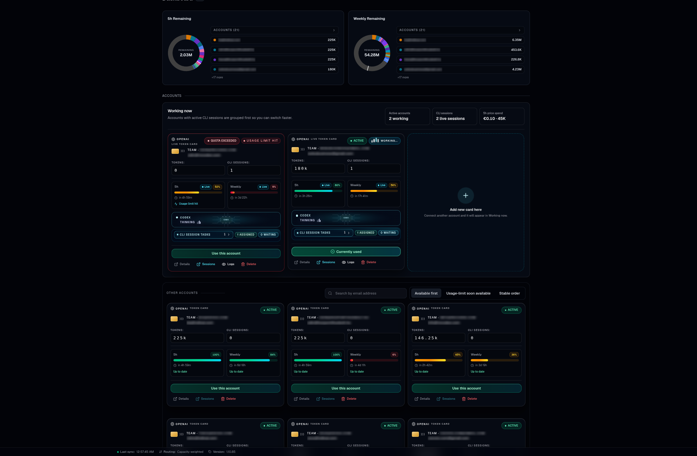

# musafety (MULTI AGENTS SAFETY PROTCOL)

## 🚀 Commit with confidence 🚀

[](https://www.npmjs.com/package/musafety)
[](https://github.com/recodeecom/multiagent-safety/actions/workflows/ci.yml)
[](https://securityscorecards.dev/viewer/?uri=github.com/recodeecom/multiagent-safety)

Simple, hardened multi-agent safety setup for any git repo.

> [!WARNING]
> Not affiliated with OpenAI or Codex. Not an official tool.

## Why this tool exists

If you run multiple agents at the same time, it is easy to get collisions:
two agents editing the same files, unsafe deletes, broken branch flow, or
confusing ownership.

`musafety` adds strict guardrails so parallel agent work stays safe and predictable.



The dashboard above is the exact kind of parallel workflow this tool is built for.

It also includes an OpenSpec planning scaffold script so plan-mode workspaces
can be bootstrapped consistently across repos.

## Install

```sh
npm i -g musafety
```

Package page: https://www.npmjs.com/package/musafety

## Security + maintenance posture

- CI matrix on Node 18/20/22 (`npm test`, `node --check`, `npm pack --dry-run`)
- trusted publishing workflow uses `npm publish --provenance` in GitHub Actions
- OpenSSF Scorecard workflow and weekly Dependabot for GitHub Actions
- Dedicated security disclosure policy in [`SECURITY.md`](./SECURITY.md)

Related tools:

- [oh-my-codex (OMX)](https://github.com/Yeachan-Heo/oh-my-codex)
- [OpenSpec](https://github.com/Fission-AI/OpenSpec)

## Fast setup (recommended)

```sh
# inside your repo
musafety setup
```

That one command runs:

1. detects whether OMX/OpenSpec are already globally installed,
2. asks Y/N approval (default `Y`) only if something is missing,
3. installs guardrail scripts/hooks,
4. repairs common safety problems,
5. installs local Codex + Claude musafety helper skill files if missing,
6. auto-creates a sibling `main` worktree + VS Code workspace file for dual-branch SCM view (when setup/doctor/install runs from a non-`main` branch),
7. scans and reports final status.

## Setup screenshot


## Status logs screenshot


## AI helper skills installed by setup/doctor

`musafety setup` and `musafety doctor` also ensure these local helper files exist:

- Codex skill: `.codex/skills/musafety/SKILL.md`
- Claude command: `.claude/commands/musafety.md` (use as `/musafety`)

When you run setup/doctor/install from a non-`main` branch, they also maintain a dual-view workspace so Source Control can show your active branch and `main` side-by-side:

- main view worktree: `<repo>-main`
- workspace file: `<repo>-branches.code-workspace`

## Scorecard report generation

Create/update markdown reports from OpenSSF Scorecard JSON:

```sh
musafety report scorecard --repo github.com/recodeecom/multiagent-safety
```

By default this writes:

- `docs/reports/openssf-scorecard-baseline-YYYY-MM-DD.md`
- `docs/reports/openssf-scorecard-remediation-plan-YYYY-MM-DD.md`

## Workflow protocol screenshots

### 1) Start isolated agent branch/worktree


`agent-branch-start` defaults to isolated worktrees. In-place starts are blocked unless you pass both
`--in-place --allow-in-place` explicitly.

### 2) Lock claim + deletion guard protocol


### 3) Multi-agent branch visibility (IDE/source control style)


## Quick setup checklist

```sh
npm i -g musafety
musafety setup
musafety doctor
bash scripts/agent-branch-start.sh "task" "agent-name"
python3 scripts/agent-file-locks.py claim --branch "$(git rev-parse --abbrev-ref HEAD)" <file...>
bash scripts/agent-branch-finish.sh --branch "$(git rev-parse --abbrev-ref HEAD)"
bash scripts/openspec/init-plan-workspace.sh "<plan-slug>"
musafety protect add release staging
musafety sync --check
musafety sync
```

## Basic commands

```sh
musafety status [--target <path>] [--json]
musafety setup [--target <path>] [--dry-run] [--yes-global-install|--no-global-install] [--no-gitignore] [--no-main-view]
musafety doctor [--target <path>] [--dry-run] [--json] [--keep-stale-locks] [--no-gitignore] [--no-main-view]
musafety protect list [--target <path>]
musafety protect add <branch...> [--target <path>]
musafety protect remove <branch...> [--target <path>]
musafety protect set <branch...> [--target <path>]
musafety protect reset [--target <path>]
musafety finish [--target <path>] [--base <branch>] [--branch <branch>] [--no-push] [--keep-remote-branch]
musafety sync --check [--target <path>] [--base <branch>] [--json]
musafety sync [--target <path>] [--base <branch>] [--strategy rebase|merge] [--ff-only]
musafety report scorecard [--target <path>] [--repo github.com/<owner>/<repo>] [--scorecard-json <file>] [--output-dir <path>] [--date YYYY-MM-DD]
bash scripts/agent-worktree-prune.sh   # manual stale worktree cleanup
bash scripts/openspec/init-plan-workspace.sh <plan-slug>   # optional OpenSpec plan scaffold
```

No command defaults to `musafety status` (non-mutating health/status view).
`musafety status` reports CLI/runtime info, global OMX/OpenSpec service status, and repo safety service state.
If Docker markers are detected in the repo (`docker-compose.yml`, `compose.yml`, `Dockerfile*`),
status/doctor also check Docker runtime and print a red warning when Docker needs to be started.
When run in an interactive terminal, default `musafety` checks npm for a newer version first
and asks `[Y/n]` whether to update immediately (default is `Y`).

- Interactive setup: prompts for Y/N approval before global OMX/OpenSpec install.
- Interactive prompt uses `[Y/n]` (default is `Y`) and waits for Enter.
- Non-interactive setup: skips global installs by default; use `--yes-global-install` to force.

## Advanced commands

```sh
musafety install [--target <path>] [--force] [--skip-agents] [--skip-package-json] [--no-gitignore] [--no-main-view] [--dry-run]
musafety scan [--target <path>] [--json]
musafety report help
```

## Keep agent branches synced with your base branch

Use sync checks before finishing agent branches:

```sh
musafety sync --check
musafety sync
```

Defaults:

- base branch: `multiagent.baseBranch` when configured, otherwise auto-detected from the repo (current non-agent branch, then `origin/HEAD`, then `dev/main/master`)
- strategy: `rebase` (or `multiagent.sync.strategy`)

Useful variants:

```sh
musafety sync --strategy merge
musafety sync --all-agent-branches --check
```

By default, `agent-branch-finish.sh` also blocks finishing when your branch is behind `origin/<base>` and points to `musafety sync`.
You can run the same flow via CLI with `musafety finish`.

Finish flow defaults:

1. push source `agent/*` branch to `origin`,
2. merge it into the detected base branch,
3. push base branch update,
4. delete the source branch locally and on remote.

Optional pre-commit behind-threshold gate (off by default):

```sh
git config multiagent.sync.requireBeforeCommit true
git config multiagent.sync.maxBehindCommits 0
```

With that enabled, agent-branch commits are blocked if the branch is behind `origin/<base>` by more than the configured threshold.

## Configure protected branches

Default protected branches are:

- `dev`
- `main`
- `master`

You can manage additional protected branches via CLI:

```sh
musafety protect list
musafety protect add release staging
musafety protect remove dev
musafety protect set main release hotfix
musafety protect reset
```

Configuration is stored in local git config key:

```text
multiagent.protectedBranches
```

Codex/OMX agent branch guard is enabled by default in pre-commit and can be configured with:

```text
multiagent.codexRequireAgentBranch
```

Auto-finish on agent commit (isolated worktrees) is enabled by default and can be configured with:

```text
multiagent.autoFinishOnCommit
```

## What is protected

- direct commits to protected branches (defaults: `dev`, `main`, `master`; configurable via `musafety protect ...`)
- protected-branch commits are blocked regardless of commit client (including VS Code Source Control)
- Codex/OMX session commits are blocked on non-`agent/*` branches by default (keeps human branch untouched while agents use isolated branches)
- agent commits on `agent/*` branches auto-finish by default (push -> merge to base -> delete agent branch local+remote)
- overlapping file ownership between agents
- unapproved deletions of claimed files
- risky stale/missing lock state
- accidental loss of critical guardrail files
- setup also writes a managed `.gitignore` block so generated musafety scripts/hooks stay out of normal git status noise by default
  - pass `--no-gitignore` if you want to keep tracking these files in git
- setup/doctor/install also auto-maintain `<repo>-main` + `<repo>-branches.code-workspace` for dual-repo Source Control view when run from a non-`main` branch
  - pass `--no-main-view` to skip that automation

## Files it installs

```text
scripts/agent-branch-start.sh
scripts/agent-branch-finish.sh
scripts/agent-worktree-prune.sh
scripts/agent-file-locks.py
scripts/install-agent-git-hooks.sh
scripts/openspec/init-plan-workspace.sh
.githooks/pre-commit
.githooks/post-commit
.codex/skills/musafety/SKILL.md
.claude/commands/musafety.md
.omx/state/agent-file-locks.json
```

If `package.json` exists, it also adds helper scripts (`agent:*`).

## Local development

```sh
npm test
node --check bin/multiagent-safety.js
npm pack --dry-run
```

## Release notes

### v0.4.6

- Added repository metadata (`repository`, `bugs`, `homepage`, `funding`) in package manifest.
- Added CI workflow for Node 18/20/22 with packaging and syntax verification.
- Added npm provenance-oriented release workflow, OpenSSF Scorecard workflow, and Dependabot for Actions.
- Added explicit `SECURITY.md` and `CONTRIBUTING.md`.

### v0.4.5

- Added optional pre-commit behind-threshold sync gate (`multiagent.sync.requireBeforeCommit`, `multiagent.sync.maxBehindCommits`).
- Added `musafety sync` workflow (`--check`, sync strategies, report mode).
- `agent-branch-finish.sh` now blocks finishing when source branch is behind `origin/<base>` (config-aware).

### v0.4.4

- Added `scripts/agent-worktree-prune.sh` to templates/install.
- `agent-branch-finish.sh` now auto-runs prune after merge (best effort).
- Added npm helper script: `agent:cleanup`.

### v0.4.2

- Setup now detects existing global OMX/OpenSpec installs first.
- If tools are already present, setup skips global install automatically.
- Interactive approval now uses `[Y/n]` (default is `Y`).
- Added setup screenshot to README.
- Added 3 additional workflow screenshots (branch start, lock/delete guard, source-control view).

### v0.4.0

- Added setup-time Y/N approval prompt for optional global install of:
  - `oh-my-codex`
  - `@fission-ai/openspec`
- Added setup flags for automation:
  - `--yes-global-install`
  - `--no-global-install`
- Added official repo links for OMX and OpenSpec.
